# 01 — Building the Lab Network

Before touching Wazuh or Sysmon, I needed all three VMs (Ubuntu, Windows, Kali) talking to each other but isolated from my home LAN. VirtualBox gives you a few options here and I burned some time picking the wrong one first, so I'm documenting that too.

## Why NAT Network, not Host-Only or plain NAT

- **Plain NAT** (per-VM default): each VM gets its own private NAT instance — they can reach the internet but **cannot see each other**. No good for a SIEM lab.
- **Host-only (`vboxnet0`)**: VMs can see each other and the host, but have **no internet access** — can't `apt install` or `yum install` anything.
- **NAT Network**: a single virtual switch shared by every VM attached to it. VMs can reach each other *and* the internet through NAT. This is the one I wanted.

My first attempt at configuring this went to the wrong panel — I was editing `vboxnet0` (Host-only Network Manager) instead of File → Preferences → Network → **NAT Networks**. Looks similar at a glance, completely different feature.

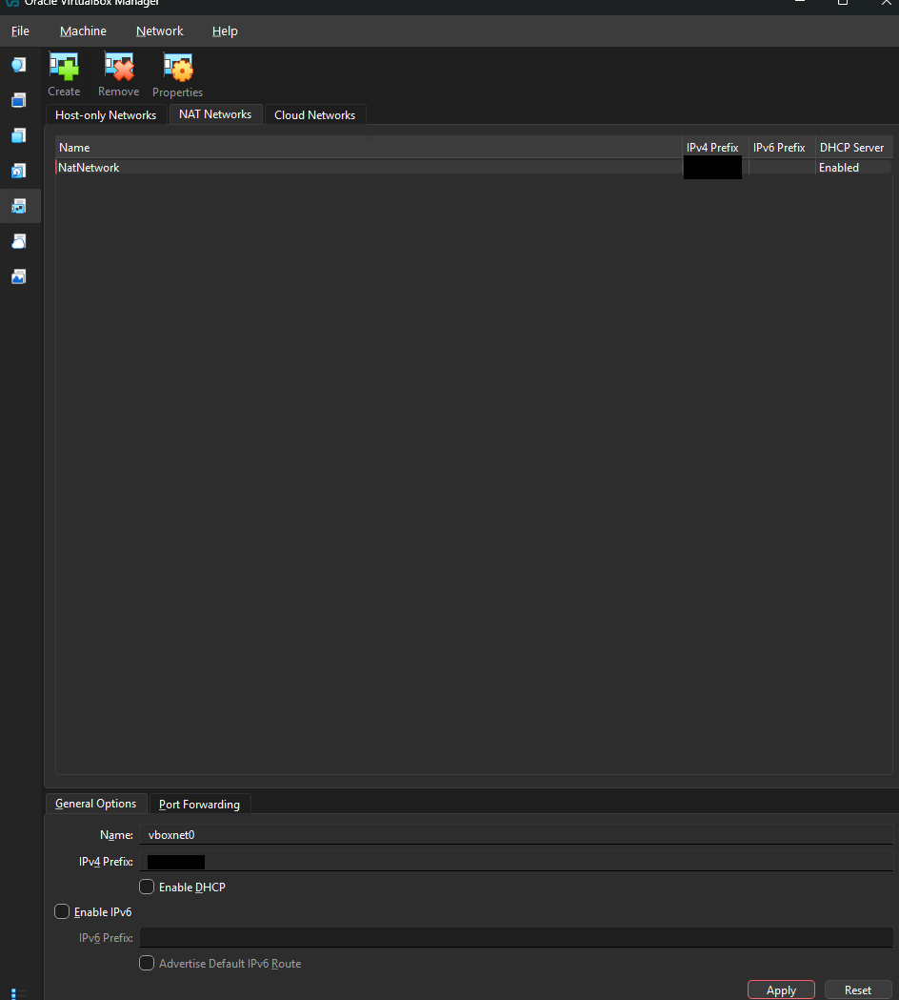

### Creating the NAT Network correctly

In VirtualBox Manager:

```
File → Preferences → Network → NAT Networks → Add (the + icon)
```

I named it `NatNetwork` (default), gave it CIDR `10.0.2.0/24`, and made sure DHCP was disabled since I wanted predictable addressing per VM rather than VirtualBox handing out random leases.

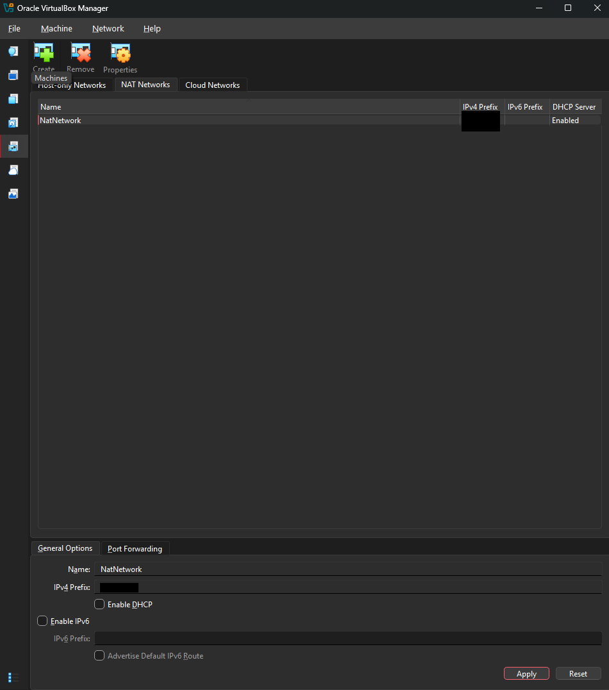

I later went back and enabled IPv6 + DHCP on the network object itself (this only controls whether the network *offers* DHCP — each VM still needs to be told to actually use it, see below):

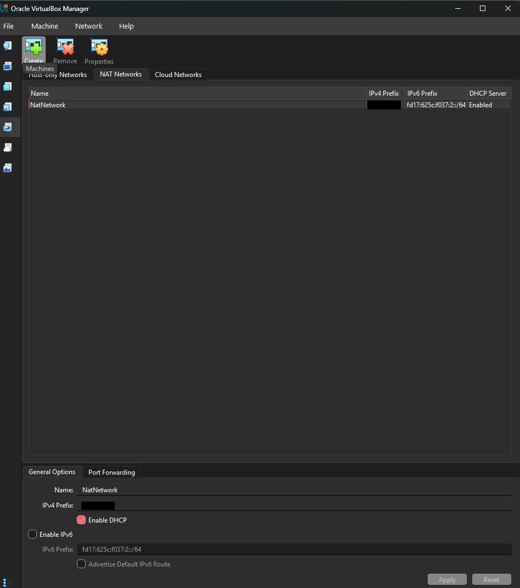

## Attaching all three VMs to the same NAT Network

For **each** VM (Windows, Kali, Ubuntu) — Settings → Network → Adapter 1:

- Attached to: **NAT Network**
- Name: **NatNetwork** (the one created above)

Windows:


Kali:
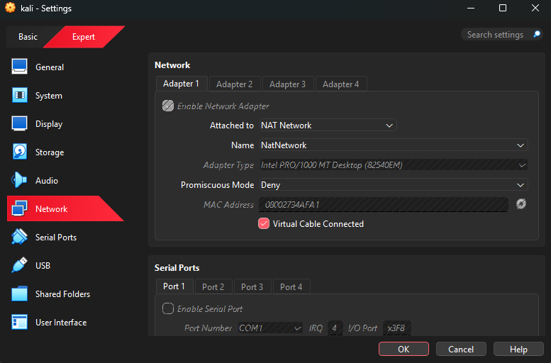

Ubuntu:
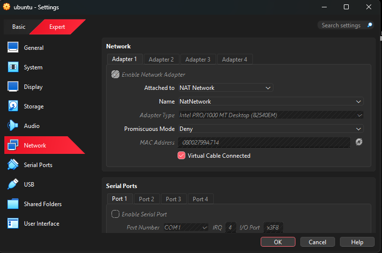

Once all three were booted on the same network:

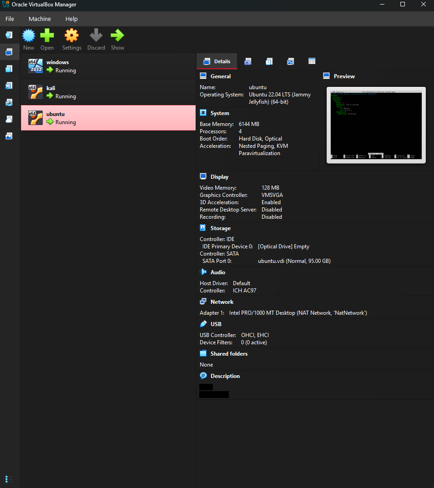

## Getting Ubuntu its address

Ubuntu came up with a DHCP-assigned address first, confirmed with:

```bash
ip a
```

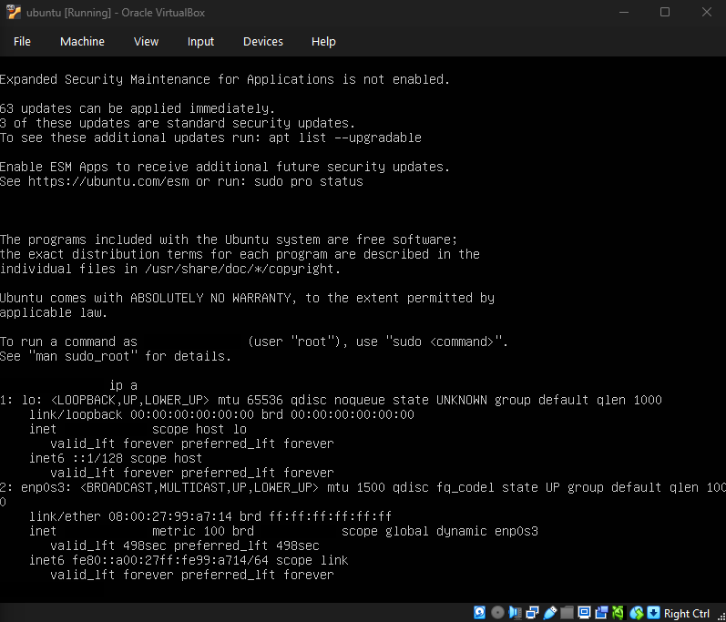

Since the Ubuntu box is the Wazuh manager, I wanted its IP to stop changing (every Windows agent config points at this address), so I switched it to a static IP via Netplan:

```bash
sudo nano /etc/netplan/00-installer-config.yaml
```

```yaml
network:
  version: 2
  ethernets:
    enp0s3:
      dhcp4: no
      addresses: [10.0.2.15/24]
      routes:
        - to: default
          via: 10.0.2.1
      nameservers:
        addresses: [8.8.8.8, 1.1.1.1]
```

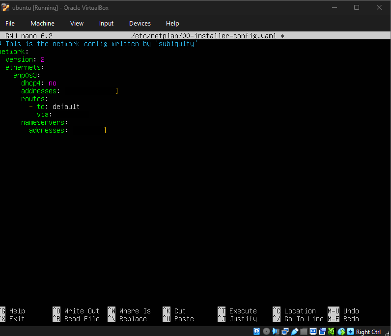

Apply it:

```bash
sudo netplan apply
```

> Real addresses are blanked out in the screenshot above and replaced with placeholders in this doc — use whatever range your NAT Network's CIDR actually is (check File → Preferences → Network → NAT Networks → your network → Network CIDR).

## Confirming everyone can see everyone

Basic ICMP checks from all three directions:

**Windows → Ubuntu / Kali:**
```
ping <ubuntu-ip>
ping <kali-ip>
```
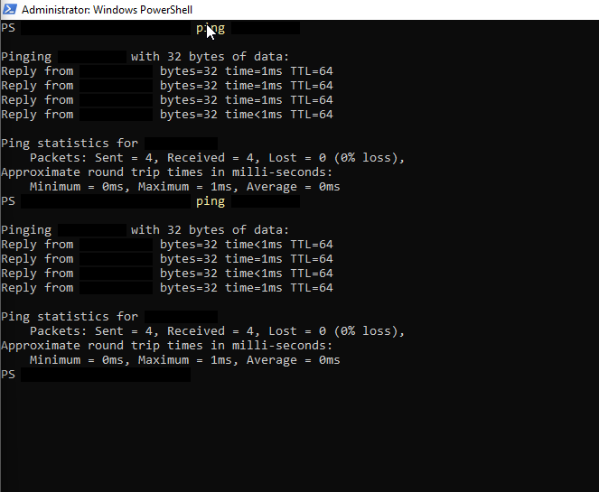

**Kali → Windows / Ubuntu:**
```bash
ping -c 4 <windows-ip>
ping -c 4 <ubuntu-ip>
```
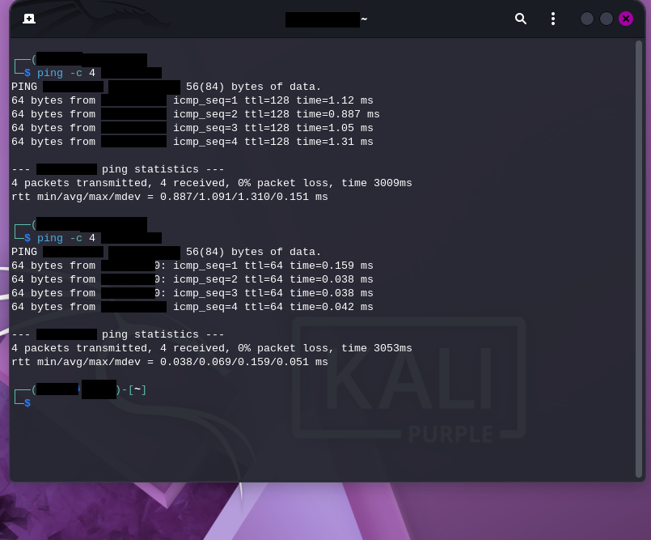

**Ubuntu → Windows / Kali:**
```bash
ping -c 4 <windows-ip>
ping -c 4 <kali-ip>
```
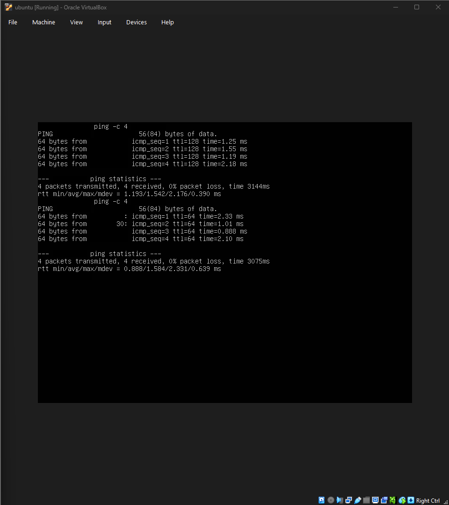

All green. Network layer done — moved on to installing Wazuh.

**Next:** [02 — Wazuh Install](02-wazuh-install.md)
