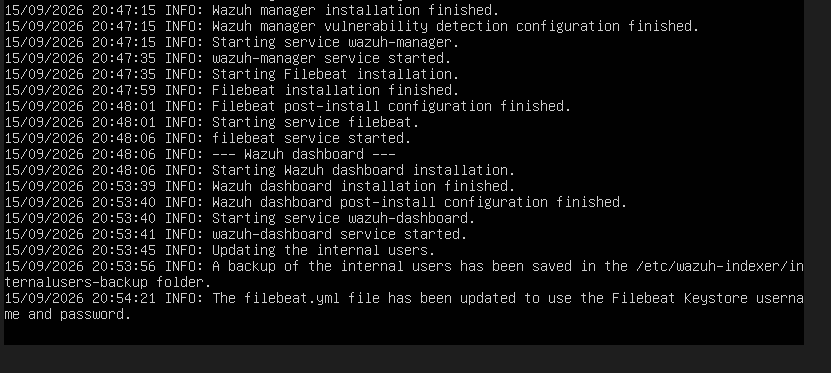
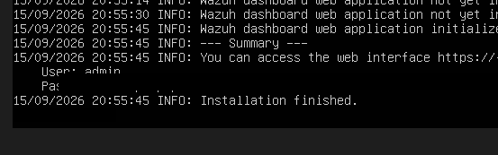
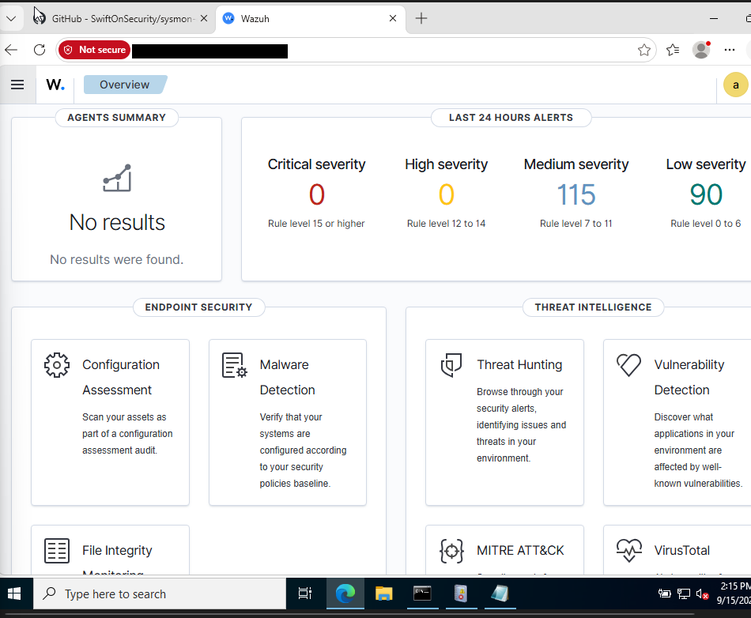
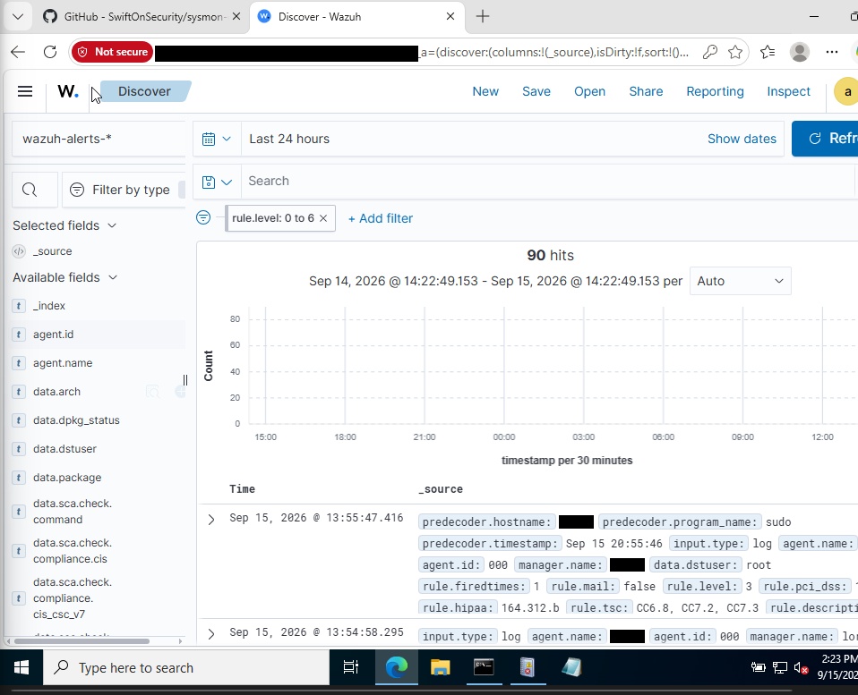

# 02 — Installing Wazuh (Manager + Indexer + Dashboard)

Wazuh manager runs on the Ubuntu VM. I used the all-in-one install script, which sets up the three components in one go: **wazuh-indexer** (storage, OpenSearch-based), **wazuh-manager** (the actual SIEM/ruleset engine), and **wazuh-dashboard** (the web UI).

## Prerequisites

- Ubuntu Server (I used 22.04) with at least 4 GB RAM / 2 vCPUs — the indexer is the heavy part
- Static IP already configured (see [01](01-network-setup.md))
- Internet access from the VM (the NAT Network handles this)

## Running the install

```bash
curl -sO https://packages.wazuh.com/4.7/wazuh-install.sh
sudo bash wazuh-install.sh -a
```

The `-a` flag tells the script to do the full all-in-one install (indexer + manager + dashboard on the same host) rather than a distributed setup. This takes a while — the indexer and dashboard installs are the slow parts. Tail end of the install log:

```
15/09/2026 20:47:15 INFO: Wazuh manager installation finished.
15/09/2026 20:47:15 INFO: Wazuh vulnerability detection configuration finished.
15/09/2026 20:47:15 INFO: Starting service wazuh-manager.
15/09/2026 20:47:35 INFO: wazuh-manager service started.
15/09/2026 20:47:35 INFO: Starting Filebeat installation.
15/09/2026 20:47:59 INFO: Filebeat installation finished.
15/09/2026 20:48:01 INFO: Filebeat post-install configuration finished.
15/09/2026 20:48:01 INFO: Starting service filebeat.
15/09/2026 20:48:06 INFO: filebeat service started.
15/09/2026 20:48:06 INFO: --- Wazuh dashboard ---
15/09/2026 20:48:06 INFO: Starting Wazuh dashboard installation.
15/09/2026 20:53:39 INFO: Wazuh dashboard installation finished.
15/09/2026 20:53:40 INFO: Wazuh dashboard post-install configuration finished.
15/09/2026 20:53:41 INFO: wazuh-dashboard service started.
15/09/2026 20:53:45 INFO: Updating the internal users.
```



## Grabbing the admin credentials

At the very end, the installer prints the dashboard URL and the auto-generated `admin` password — **this only gets printed once**, so copy it somewhere safe immediately (a password manager, not a plaintext note on the desktop):

```
--- Summary ---
You can access the web interface https://<ubuntu-ip>
    User: admin
    Password: <auto-generated, shown once>
Installation finished.
```



If you lose it, you can regenerate the dashboard password later with:

```bash
sudo /var/ossec/bin/wazuh-passwords-tool -u admin -p <new-password>
```

## First login to the dashboard

Navigated to `https://<ubuntu-ip>` (self-signed cert, so the browser complains — expected in a lab, just accept the warning), logged in with `admin` and the generated password.

Fresh install, zero agents connected yet:



Confirmed the manager itself is logging correctly by checking **Discover** and filtering to the manager's own internal agent (`agent.id: 000`, which is always the manager itself):



Manager's alive and logging its own events. Next step: get Sysmon running on the Windows box so there's something worth shipping to this manager.

**Next:** [03 — Sysmon on the Windows Agent](03-sysmon-windows-agent.md)
