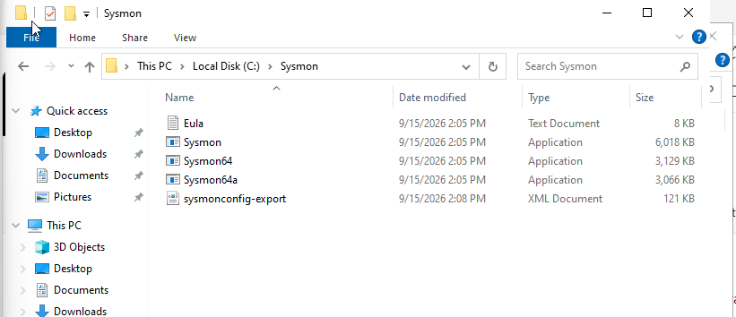
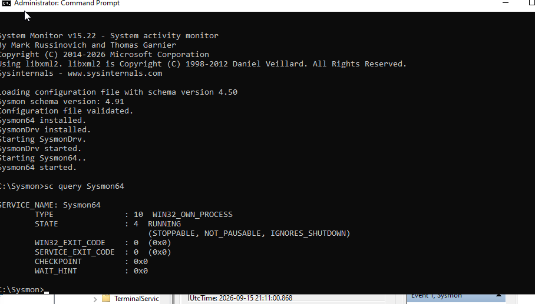
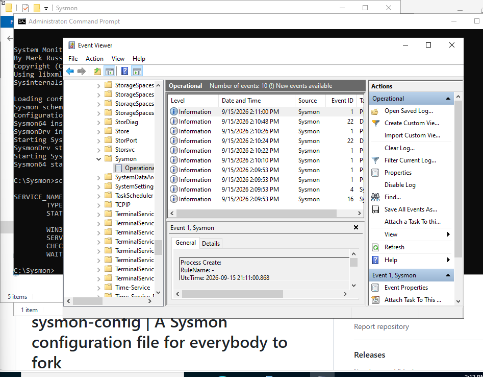
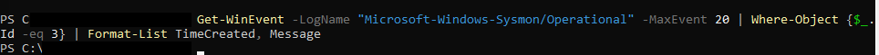
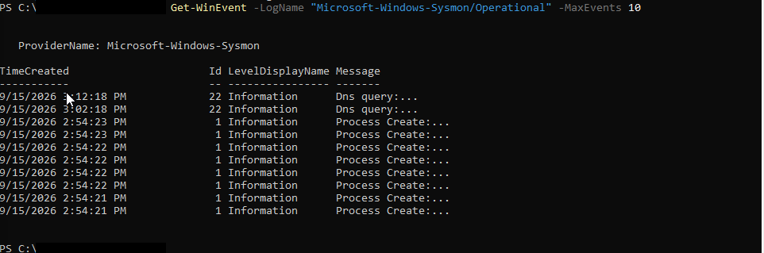
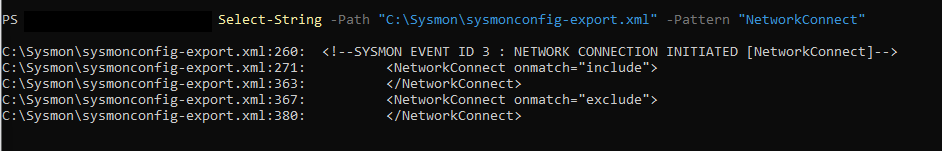

# 03 — Installing Sysmon on the Windows Endpoint

The Wazuh agent alone gives you Windows Event Log forwarding, but the default Windows Security log is fairly shallow on process and network detail. **Sysmon** (Sysinternals System Monitor) fills that gap — process creation with full command lines, network connections, image loads, etc. — and Wazuh has good out-of-the-box rules for it.

## Downloading and staging Sysmon

Grabbed Sysmon from the official Microsoft Sysinternals site and a community Sysmon config (SwiftOnSecurity-style baseline, which is the de facto standard starting config most SOC labs use) into `C:\Sysmon`:



Folder contains:
- `Sysmon64.exe` — the actual binary
- `sysmonconfig-export.xml` — the ruleset (what to log, what to ignore)

## Installing it

From an elevated (Administrator) Command Prompt:

```cmd
cd C:\Sysmon
Sysmon64.exe -i sysmonconfig-export.xml -accepteula
```

`-i` installs the driver and service with the given config, `-accepteula` skips the interactive EULA prompt (needed for non-interactive/scripted installs). Confirmed it's actually running:

```cmd
sc query Sysmon64
```

```
SERVICE_NAME: Sysmon64
        TYPE               : 10  WIN32_OWN_PROCESS
        STATE              : 4  RUNNING
                            (STOPPABLE, NOT_PAUSABLE, IGNORES_SHUTDOWN)
        WIN32_EXIT_CODE    : 0  (0x0)
        SERVICE_EXIT_CODE  : 0  (0x0)
```



## Confirming events are flowing into Event Viewer

Sysmon writes to its own event channel, not the standard Security log:

```
Applications and Services Logs → Microsoft → Windows → Sysmon → Operational
```



Events flowing. Good sign the driver and config both loaded correctly.

## A troubleshooting detour: Event ID 3 (network connections)

Later on, while preparing to detect the RDP attack, I wanted to confirm Sysmon Event ID 3 (`NetworkConnect`) would actually log the incoming RDP connections from Kali. First check came back empty:

```powershell
Get-WinEvent -LogName "Microsoft-Windows-Sysmon/Operational" | Where-Object {$_.Id -eq 3}
```



Checked the last 10 Sysmon events generally — no network connection events showing up at all, just process creation and image load events:



Turned out the default SwiftOnSecurity config ships `NetworkConnect` mostly in **exclude** mode — it's deliberately noisy to disable by default, and only enables logging for a short allow-list of processes. Checked what the config actually said:

```powershell
Select-String -Path "C:\Sysmon\sysmonconfig-export.xml" -Pattern "NetworkConnect"
```

```
C:\Sysmon\sysmonconfig-export.xml:260:  <!--SYSMON EVENT ID 3 : NETWORK CONNECTION INITIATED [NetworkConnect]-->
C:\Sysmon\sysmonconfig-export.xml:271:      <NetworkConnect onmatch="include">
C:\Sysmon\sysmonconfig-export.xml:363:      </NetworkConnect>
C:\Sysmon\sysmonconfig-export.xml:367:      <NetworkConnect onmatch="exclude">
C:\Sysmon\sysmonconfig-export.xml:380:      </NetworkConnect>
```



For this lab, RDP logon detection ended up coming from the **Windows Security log** (Event ID 4624/4625) via the Wazuh agent rather than from Sysmon Event ID 3 — which is realistic: in most real deployments, Security log auth events are still the primary source for logon telemetry, and Sysmon is tuned deliberately to stay quiet on routine network noise unless you explicitly widen the include list. Documenting the "empty query" moment here because figuring out *why* a log source is quiet is as much a part of blue-team work as reading the ones that fire.

**Next:** [04 — Agent Enrollment](04-agent-enrollment.md)
