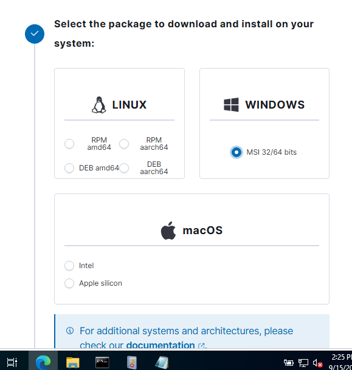
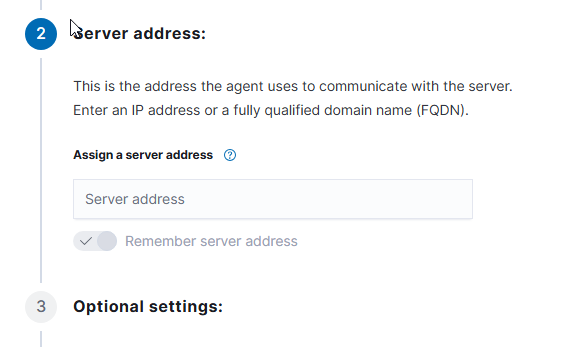
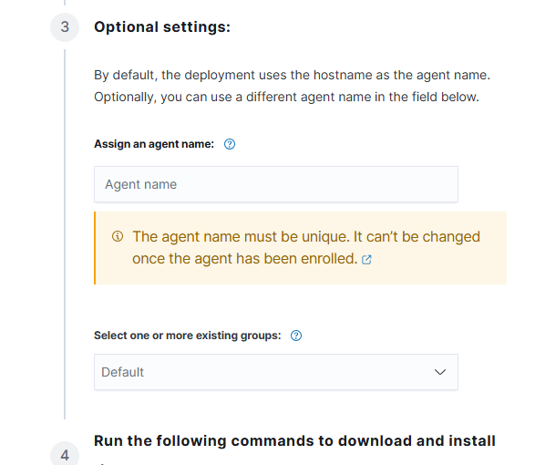
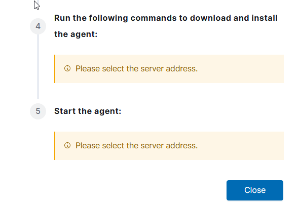
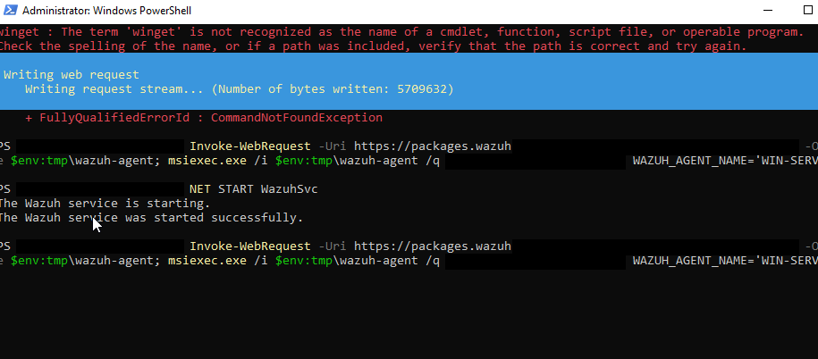
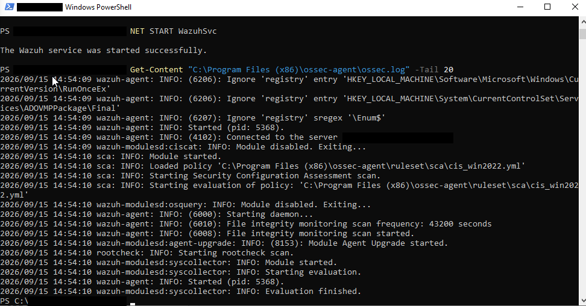
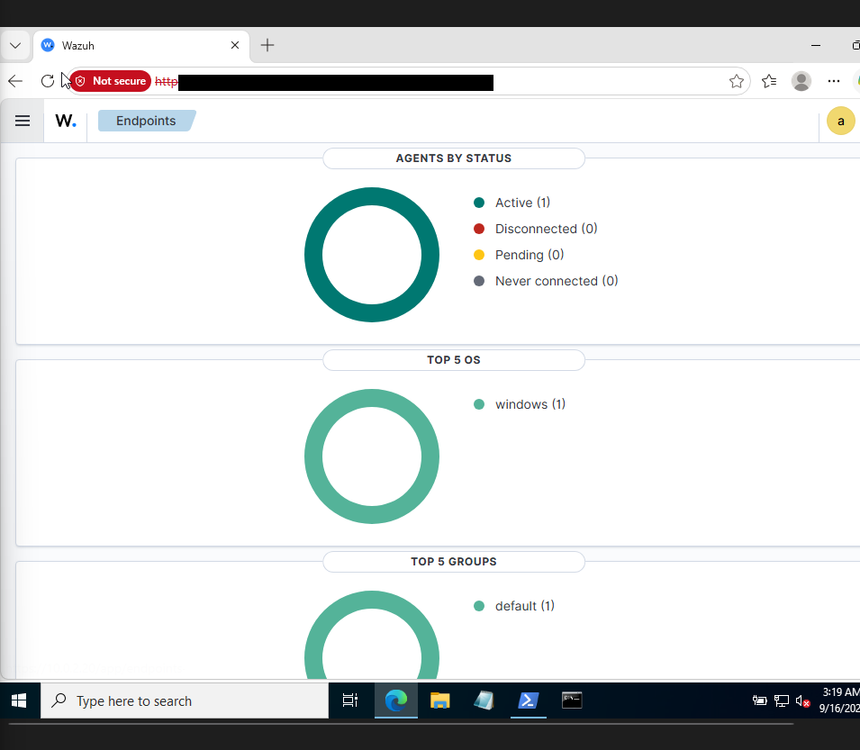

# 04 — Enrolling the Windows Endpoint as a Wazuh Agent

With Sysmon logging locally, the next step is getting that data (plus the standard Windows Event Log) shipped to the Wazuh manager. This means installing the **Wazuh agent** on Windows and pointing it at the manager's IP.

## Using the dashboard's "Deploy new agent" wizard

Wazuh dashboard has a guided flow: **Agents → Deploy new agent**. Walked through it:

**Step 1 — pick the OS.** Selected Windows:



**Step 2 — server address.** This is the field that has to be the Wazuh **manager's** IP (the Ubuntu box), not the agent's own IP. I left it blank on my first pass through the wizard just to see what the generated command looked like before filling it in:



**Step 3 — optional settings** (agent name, group). I set the agent name explicitly so it'd be easy to find in the dashboard later instead of relying on the auto-detected hostname:



**Steps 4–5 — generated install command.** The wizard was still waiting on me to fill in the server address before it would render the final PowerShell command:



Once the manager address was set correctly, the wizard generates a one-liner like this to run on the Windows box (elevated PowerShell):

```powershell
Invoke-WebRequest -Uri https://packages.wazuh.com/4.x/windows/wazuh-agent-4.7.0-1.msi -OutFile $env:tmp\wazuh-agent
msiexec.exe /i $env:tmp\wazuh-agent /q WAZUH_MANAGER='<manager-ip>' WAZUH_AGENT_NAME='WIN-SERVER'
NET START WazuhSvc
```

## Mistake #1: pointed the agent at the wrong IP

First install attempt, I fat-fingered the manager IP in `WAZUH_MANAGER=` — the install itself succeeded (`msiexec` doesn't validate connectivity, it just writes the config) and the service started fine, so on the surface everything looked okay:

```
The Wazuh service is starting.
The Wazuh service was started successfully.
```



But nothing showed up on the manager side — no new agent, no logs. Classic case of "the install said success" not meaning "the agent is actually talking to anyone."

**Fix:** edited the agent config directly instead of reinstalling:

```
C:\Program Files (x86)\ossec-agent\ossec.conf
```

Updated the `<address>` field under `<server>` to the correct Ubuntu IP, then restarted the service:

```powershell
Restart-Service WazuhSvc
```

## Confirming the connection

Tailed the agent's own log to confirm it actually shook hands with the manager this time:

```powershell
Get-Content "C:\Program Files (x86)\ossec-agent\ossec.log" -Tail 20
```

```
wazuh-agent: INFO: (4102): Connected to the server <manager-ip>
wazuh-agent: INFO: (6010): File integrity monitoring scan frequency: 43200 seconds
wazuh-agent: INFO: (6008): File integrity monitoring scan started.
wazuh-modulesd:syscollector: INFO: Starting evaluation.
```



`(4102): Connected to the server` — that's the line I was looking for.

## Verifying from the dashboard side

Back in Wazuh dashboard → **Endpoints**, the Windows agent now shows up as **active**:



Agent enrolled, Sysmon and Windows Security events now flowing into the SIEM. Time to give it something to actually detect.

**Next:** [05 — Attack Simulation](05-attack-simulation.md)
