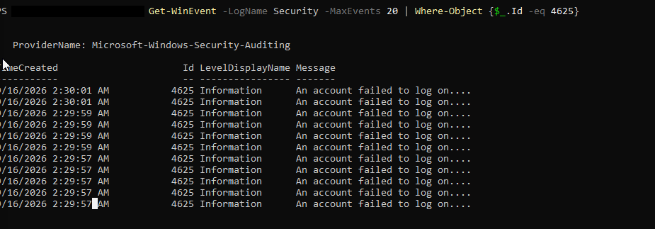
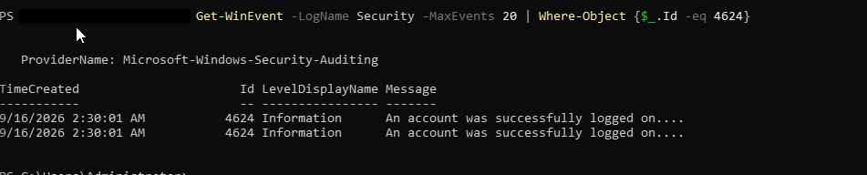
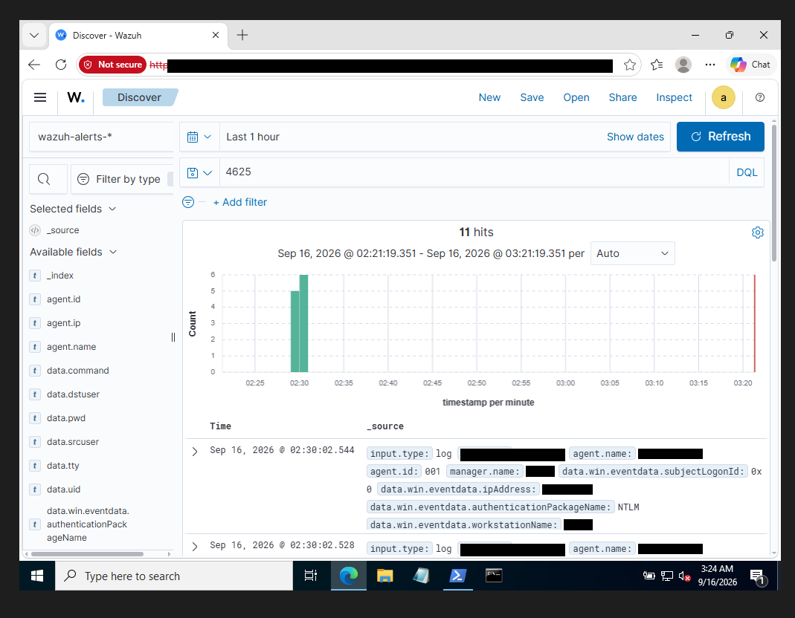
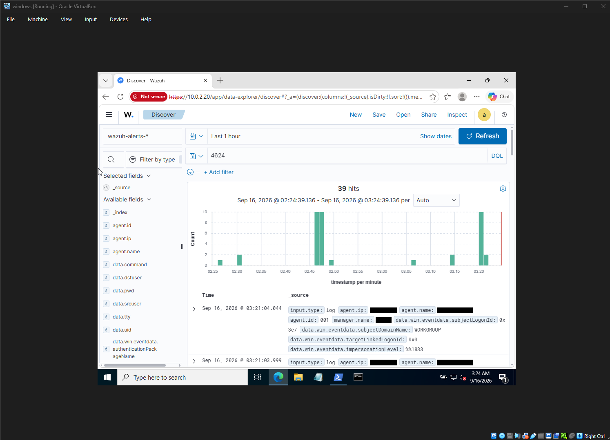
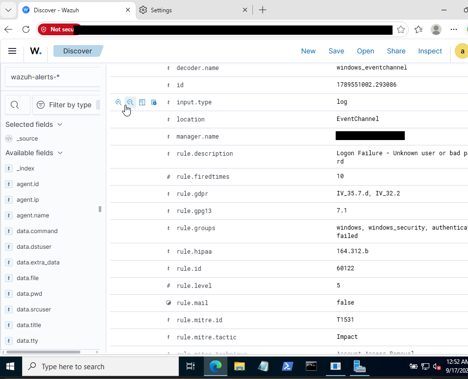
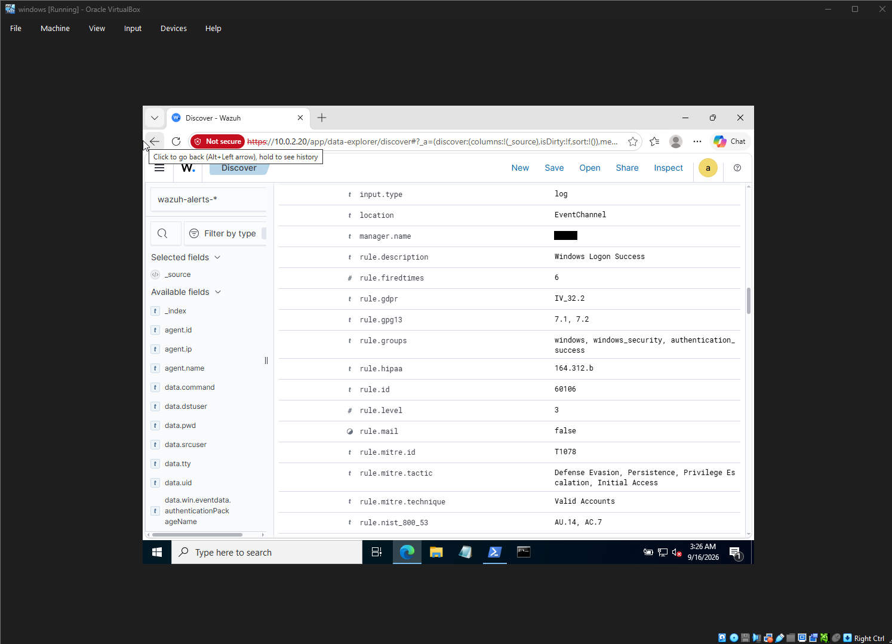

# 06 — Detection in Wazuh & MITRE ATT&CK Mapping

This is the payoff of the whole lab: did the attack from [05](05-attack-simulation.md) actually show up where a real analyst would be looking?

## Step 1 — check the raw Windows Security log first

Before even opening Wazuh, I wanted to confirm the raw evidence existed locally on the Windows box, the way you'd sanity-check a log source during an incident. Both event IDs I cared about:

- **4625** — An account failed to log on
- **4624** — An account successfully logged on

```powershell
Get-WinEvent -LogName Security -MaxEvents 20 | Where-Object {$_.Id -eq 4625}
```

```
Id   LevelDisplayName Message
--   ---------------- -------
4625 Information      An account failed to log on....
4625 Information      An account failed to log on....
4625 Information      An account failed to log on....
```



Ten failed attempts clustered in the same minute or two — exactly what you'd expect from Hydra hammering the login prompt — followed by:

```powershell
Get-WinEvent -LogName Security -MaxEvents 20 | Where-Object {$_.Id -eq 4624}
```



One successful logon right after the failure streak. That's the fingerprint of a brute-force-then-success pattern — the exact thing a SOC playbook for T1110 (Brute Force) tells you to hunt for.

## Step 2 — find it in Wazuh Discover

Switched to the Wazuh dashboard, **Discover**, and searched the `wazuh-alerts-*` index for the same event IDs shipped up from the Windows agent.

**Failed logons (4625):**

```
4625
```

11 hits in the search window, clustered tightly on the timeline — matches the Hydra run:



**Successful logons (4624):**

```
4624
```

39 hits — higher than expected at first glance, but this includes normal background Windows logon activity (service accounts, SYSTEM, scheduled tasks) in addition to the one attacker logon, since 4624 fires for every successful logon type, not just interactive RDP ones:



To isolate just the attacker's session from that noise, I'd normally add filters on `data.win.eventdata.logonType: 10` (RemoteInteractive) and the specific source IP — worth calling out as the realistic next step rather than pretending the raw count alone is the finding.

## Step 3 — the Wazuh rule mapping

The real value of Wazuh over raw Event Viewer is that its ruleset already classifies these events and tags them with MITRE ATT&CK technique IDs, GDPR/HIPAA/PCI compliance mappings, and a severity level — no manual correlation needed.

### Logon failure → Rule 60122

Opened one of the 4625 alert documents in Discover:

| Field | Value |
|---|---|
| `rule.id` | 60122 |
| `rule.description` | Logon Failure - Unknown user or bad password |
| `rule.level` | 5 |
| `rule.groups` | windows, windows_security, authentication_failed |
| `rule.mitre.id` | T1531 |
| `rule.mitre.tactic` | Impact |
| `rule.mitre.technique` | Account Access Removal |
| `rule.gdpr` | IV_35.7.d, IV_32.2 |
| `rule.hipaa` | 164.312.b |



Worth being honest about this one: Wazuh's default ruleset maps generic Windows logon-failure events to **T1531 (Account Access Removal)**, which isn't a perfect semantic fit for a brute-force *attempt* — T1531 is really about an attacker locking legitimate users out, not trying passwords. In a real SOC I'd treat this as "the built-in rule got us to the right raw events, but the technique tag is generic and worth overriding with a custom rule" rather than taking the out-of-the-box MITRE tag as gospel. Repeated 60122 hits against the same account in a short window is itself a strong indicator worth alerting on regardless of which technique ID is attached — that pattern is what actually maps to **T1110 (Brute Force)**, and I'd write a custom correlation rule for that if I extended this lab further (see [lessons-learned.md](lessons-learned.md)).

### Logon success → Rule 60106

The successful logon that followed:

| Field | Value |
|---|---|
| `rule.id` | 60106 |
| `rule.description` | Windows Logon Success |
| `rule.level` | 3 |
| `rule.groups` | windows, windows_security, authentication_success |
| `rule.mitre.id` | T1078 |
| `rule.mitre.tactic` | Defense Evasion, Persistence, Privilege Escalation, Initial Access |
| `rule.mitre.technique` | Valid Accounts |
| `rule.nist_800_53` | AU.14, AC.7 |



This one's a clean, textbook mapping: **T1078 — Valid Accounts**. Once Hydra found the right password, the subsequent RDP session is functionally indistinguishable from a legitimate login using valid credentials — which is exactly why T1078 spans so many tactics (Initial Access, Persistence, Privilege Escalation, Defense Evasion all at once). It's *the* reason brute-force detection can't stop at "did they get in" — you have to catch the failure pattern beforehand, because once it succeeds, the session looks completely normal to anything that isn't correlating it against the failures that came right before it.

## Putting it together: the attack timeline

| Time (approx.) | Event | Source | Rule |
|---|---|---|---|
| 02:29–02:30 | 10–11× failed RDP logon (Hydra brute force) | Windows Security 4625 → Wazuh agent | 60122 / T1531 (tag) — really T1110 in intent |
| 02:30 | 1× successful RDP logon (valid password found) | Windows Security 4624 → Wazuh agent | 60106 / T1078 |

Ten-plus failures immediately followed by one success, all against the same account, all within about a minute — a textbook brute-force-to-compromise pattern, fully visible end-to-end in Wazuh without touching the Windows box directly. That's the detection story this lab set out to prove.

**Next:** [lessons-learned.md](lessons-learned.md)
